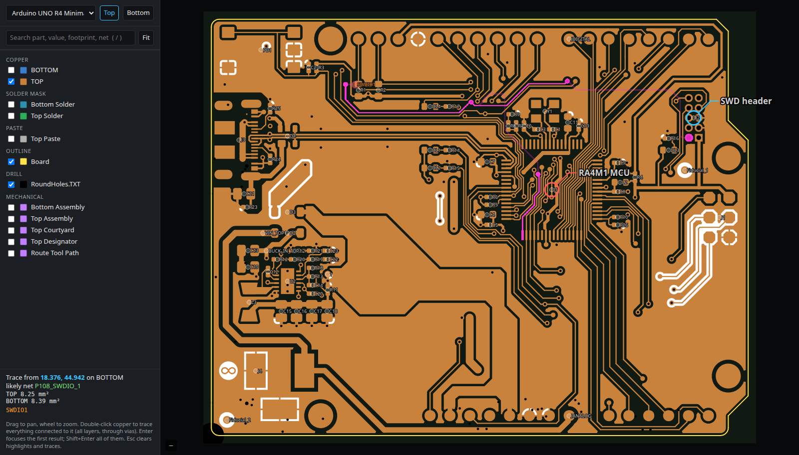

# pcb-viewer

A local, searchable viewer for any PCB's Gerbers and pick-and-place file, with
remote control: another process (a script, or an AI agent) can focus the view
you have open in your browser.

- Each Gerber and drill layer is rendered to SVG by `gerbv` over one common
  window, so every layer lines up in millimetres, in the same coordinates as
  the pick-and-place file.
- It serves on `127.0.0.1` only.



*The [example board](#try-it-on-the-arduino-uno-r4-minima) after
`pcb-viewer trace --ref SWDIO1` and
`pcb-viewer mark J2="SWD header" U1="RA4M1 MCU" --no-fit`: the debug net runs
from its test point on the bottom, through a via, to the MCU and the header.*

## Requirements

- Python 3 (developed on 3.12). Viewing and search use only the standard
  library.
- `gerbv` (`sudo apt install gerbv`).
- For copper tracing: numpy, scipy and Pillow (`pip install numpy scipy Pillow`).
- For netlists from an Altium Smart PDF: `pdftohtml` from poppler
  (`sudo apt install poppler-utils`).

Developed and tested on Linux. On macOS, Homebrew has both tools
(`brew install gerbv poppler`), but that setup is untested. Windows is
untested.

Run it as `python3 pcbview.py ...`, or link it onto your PATH as `pcb-viewer`:

```sh
ln -s "$PWD/pcbview.py" ~/.local/bin/pcb-viewer
```

## Try it on the Arduino UNO R4 Minima

Arduino publishes the UNO R4 Minima's design files under
[CC BY-SA 4.0](https://creativecommons.org/licenses/by-sa/4.0/): Gerbers, drill
files, the Altium PCB and a schematic PDF. They are not included here. Get them
from "CAD Files" on the
[board's page](https://docs.arduino.cc/hardware/uno-r4-minima/), or:

```sh
curl -LO https://docs.arduino.cc/static/ae97aad5c05de6a565c7f93a28c04717/ABX00080-cad-files.zip
unzip -q ABX00080-cad-files.zip && cd ABX00080-cad-files
pcb-viewer add uno-r4 "Manufacturing files/Gerber" \
    --pnp "Altium files/PCB.PcbDoc" \
    --netlist "Schematic ABX00080.PDF" \
    --title "Arduino UNO R4 Minima"
pcb-viewer serve &              # renders on first run, then serves :8765
pcb-viewer open uno-r4          # opens the browser
```

`add` reports five files skipped: four layers are empty, and gerbv can't read
the slot drill file (tracing still uses it). The commands below all work on
this board. For your own board, see [Adding other boards](#adding-other-boards).

In the browser:

- Drag to pan and scroll to zoom.
- `/` opens search (designator, value, footprint or net name; prefix `net:` to
  search nets only).
- Clicking a part lists its pins and their nets. Click a net to highlight
  every part on it.
- Double-clicking copper traces everything electrically connected to it, on
  every layer and through vias. The layer being viewed is shown bright, inner
  layers at half strength and the far side faint. The summary shows copper
  area per layer, the parts touched, and the likely net name (from the
  netlist).
- Enter focuses the first result; Shift+Enter focuses all of them.
- `T`/`B` switch between top and bottom. The bottom view is mirrored, as seen from below.
- `F` fits the board.
- Click a part to see its details.

Remote control (acts on the browser tab that is open):

```sh
pcb-viewer find R26             # list matches, no view change
pcb-viewer focus SWDIO1,SWCLK1  # zoom to and highlight parts
pcb-viewer net VIN              # list a net's pins
pcb-viewer focus net:+5V        # highlight every part on a net
pcb-viewer trace --ref VIN_TOP1 # trace from a part's copper (exact for test points / single pads)
pcb-viewer trace 51.4 27.0 --side top   # or from a point; --layer "Inner 3" starts on an inner layer
pcb-viewer trace-clear
pcb-viewer mark SWDIO1="SWDIO" SWCLK1="SWCLK" 20,30="note"   # callout labels; unmark removes them
pcb-viewer goto 34 27 --window 6 --side top
pcb-viewer side bottom
pcb-viewer layer "Top Designator" on   # match by label text or by kind (copper, silk, drill...)
pcb-viewer fit | clear | status # status = what the viewer is showing right now
```

## Adding other boards

`add` works out the layers from:

1. Gerber X2 file attributes, when present.
2. KiCad file names (`-F_Cu`, `-Edge_Cuts`, ...).
3. Protel/Altium/JLC extensions (`.GTL`, `.GBO`, ...), using Altium's `.EXTREP`
   report for layer names.
4. Eagle CAM extensions.

A sibling folder whose name contains "drill" is picked up automatically, or
use `--drill-dir`.

Pick-and-place formats: Altium CSV, KiCad `.pos` (CSV or ASCII), Eagle
`.mnt`/`.mnb`, and JLC-style CSV. Units come from the header or value suffixes;
the default is mm. If the parts don't sit on their pads, use `--offset dx,dy`,
and `--flip-y` for KiCad files exported with negative Y.

Without a pick-and-place file, an Altium `.PcbDoc` can stand in: placements
are read from its component records, relative to the board origin (Altium's
default for Gerbers).

Netlists (`--netlist`) can come from either source:

- **IPC-D-356(A)** (`.ipc`), which most board houses and CAD tools can
  export. Long net names come from its `NNAME` records.
- **An Altium Smart PDF schematic.** Nets are read from the PDF's bookmark
  tree. Sheet-local nets are joined through port names, power nets by name
  (which is how Altium's hierarchy connects them), and entries sharing a pin
  are merged. Net entries also record which schematic pages they appear on.

Registered boards are stored in `~/.config/pcb-viewer/boards.json`, and
renders in `~/.cache/pcb-viewer/<name>/`. Restart `serve` after `add`.

## How tracing works

1. Each copper layer is rendered by gerbv at 40 px/mm (0.025 mm per pixel) and
   labelled into connected copper islands.
2. Plated holes join the islands they pierce on every layer they connect.
   Which layers those are comes from Altium's layer-pair file (`.LDP`), so
   blind and buried microvias are honoured. Boards without one are treated as
   having only through-holes.
3. The islands are grouped into nets once, when the server starts (about 6 s
   for an 8-layer board). A trace is then a lookup, plus rendering the
   overlays: under 1 s for signal nets, a few seconds for ground.

## Known limits

- Net membership is pin level, but it is shown per part: parts are markers at
  their centroid, not individual pads.
- Tracing from a two-pad part's centroid snaps to the nearer pad. For
  certainty, double-click the pad or trace itself.
- Tracing can't separate copper closer than about 0.05 mm. Traced parts count
  only if their centroid sits on the reached copper, so large modules are
  usually not listed even when the trace ends on their pads.
- The IPC-D-356 reader has only been tested on a sample file; the Altium PDF
  reader has seen more use.
- Parts are drawn as markers at their centroid, not as footprint outlines.
  From a `.PcbDoc` the marker is the footprint's reference point, which is
  usually, but not always, its centre.
- Drill files that gerbv can't parse are skipped, and listed when rendering.

## License

The code is MIT, see [LICENSE](LICENSE).

The Arduino design files used in the example belong to Arduino and are
licensed [CC BY-SA 4.0](https://creativecommons.org/licenses/by-sa/4.0/); they
are not part of this repository. `docs/screenshot.png` shows that design, so it
is licensed CC BY-SA 4.0 too, with credit to Arduino.
